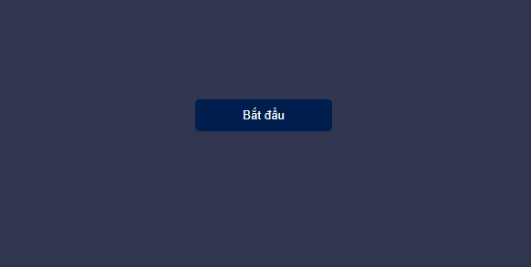
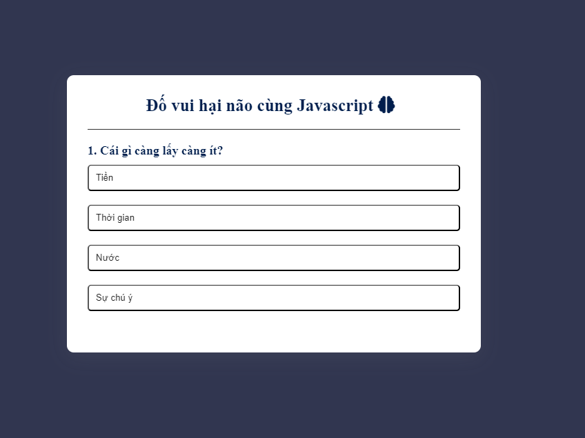
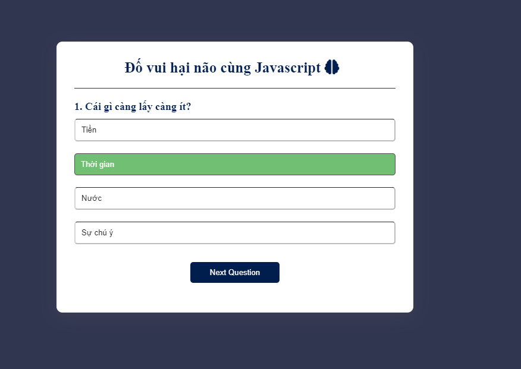
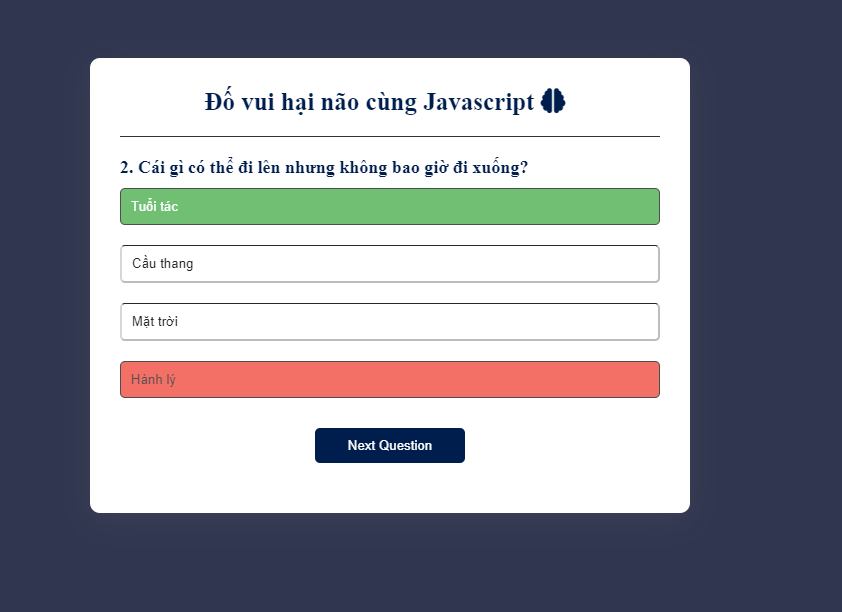
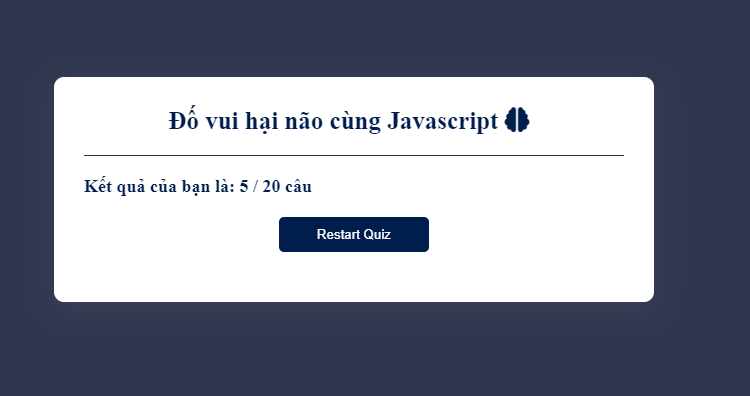
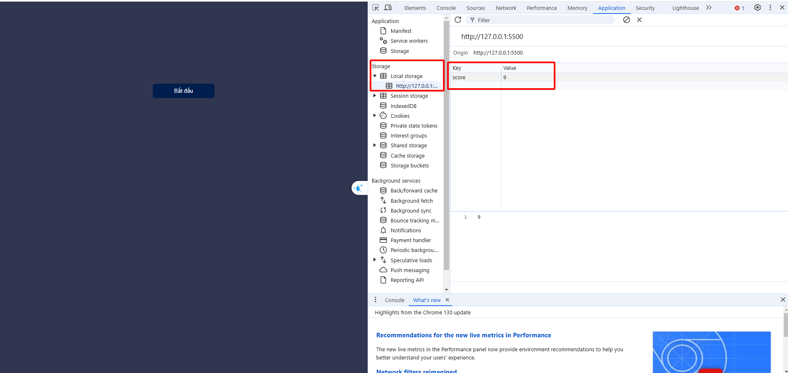

## ----------- Quiz App Quesion with JavaScript --------

Author: @Vinhdev04

# Kiến thức áp dụng:

1. Html
2. Css
3. JavaScript
4. DOM,DOM Events
5. Module (import/export) file
6. StorageAPI , sử dụng localStorage để lưu trữ điểm số dựa trên số câu trả lời đúng

# Chức năng chính

- Người dùng sẻ chọn 1/4 đáp áp gồm 1 đúng và 3 sai
- Mỗi câu đúng được 1đ sai 0đ
- Hệ thống đang fix 20 câu (chờ mở rộng mô hình)
- Sau khi chọn 1 trong 4 đáp án thì các đáp án còn lại sẻ bị "disabled"
- Hiển thị màu cho biết đúng sai
- Tiến hành hết các câu
- Reset làm lại nếu muốn

# Dự kiến Mở rộng:

- Tạo kho db lưu trữ câu hỏi lớn hơn
- Tạo random câu hỏi cho mỗi lần chơi tránh trùng số câu, và trùng số lần ,thời điểm xuất hiện
- Tạo trường user để lưu thông tin người chơi gồm Object(số lần chơi, tên và điểm) lưu vào localStorage hoặc SessionStorage, Cookie tùy hướng đi
- Bố sung câu hỏi có hình ảnh
- Tạo hiệu ứng animate khi hoàn thành lượt chơi
- Thêm suggest cho câu hỏi

# Link ảnh demo:

# link demo:

1 . https://vinhdev04.github.io/Coding/Quiz_Apps/index.html 2.
